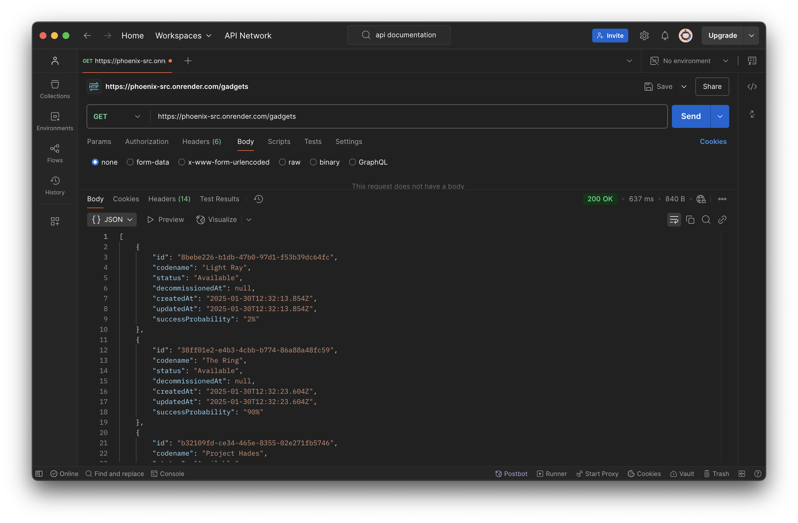
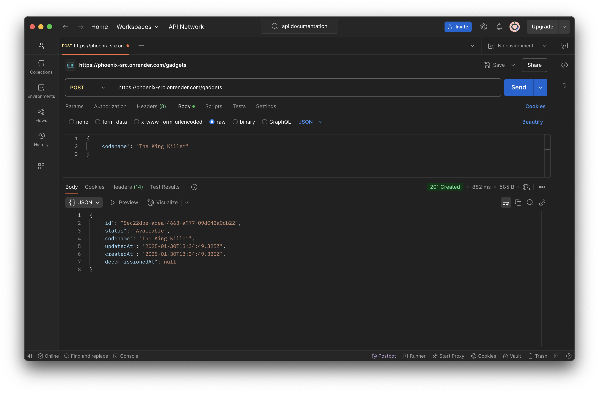
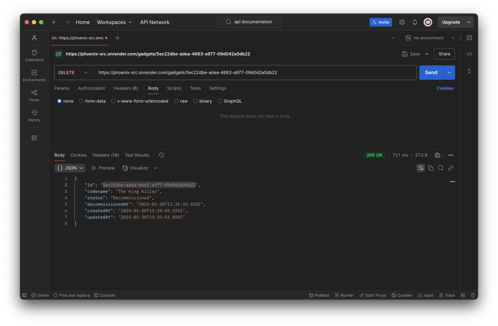
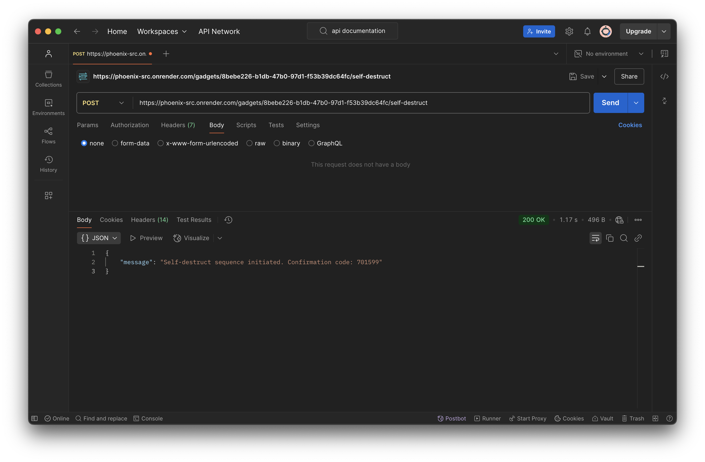

# phoenix
IMF gadget api challenge, this is currently deployed.<br>
Accessible through https://phoenix-src.onrender.com/gadgets

Tech Stack - Node.js, Express and PostgreSQL

API server and PostgreSQL Database server are both deployed on [Render](https://render.com/).

## Features of the API
```GET``` 
  - retrieve a list of all gadgets on the database
  - also shows a success percentage (randomly generated)

```POST``` 
  - add new gadgets to the database 
  - send codename as request parameter to created new gadget

```PATCH```
  - update existing gadget information
  - send the status as request parameter to update the gadget 

```DELETE```
  - remove a gadget from the inventory
  - its status will be marked as decommissioned
  - a timestamp will also be added

### Self Destruction
```POST```
- special feature
- will destroy the gadget in a fraction of 60 seconds
- but will need the confirmation code
- which will be in the response

## Other notable features
- Robust authentication system
- A search function to filter gadgets by status

## Installation
Install Node.js and npm 
To install all the packages use the below command
```
npm install
```

## Server
To run the server
```
npx nodemon app.js
```

## Usage
These are images of postman outputs for the various features

### ```get``` - retrieve all gadgets
- response with a list of gadgets

### ```post``` - create gadget
- request body contain the codeword
- server responded with all the parameters for storing the gadget in the database  

### ```patch``` - update gadget status
- passing the gadget id in the url and
- request body containing the status to update
- server responded with updated status of gadget

### ```delete``` - deleted/ decommission gadget
- passing the gadget id in the url
- server responded with updated status of gadget saying decommissioned

### ```post``` - self-destruct sequence
- passing gadgets/:id/self-destruct in the url
- server decommissioned the gadget and sent a randomly generated confirmation code
